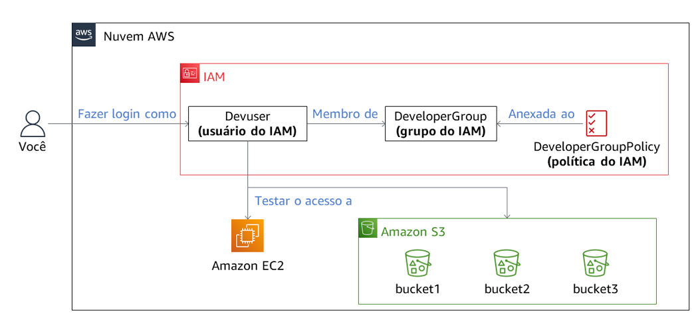
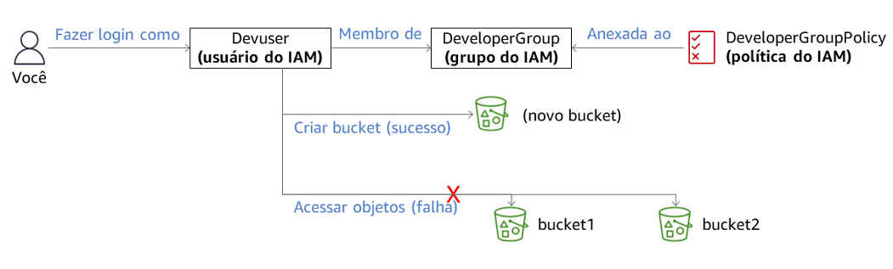
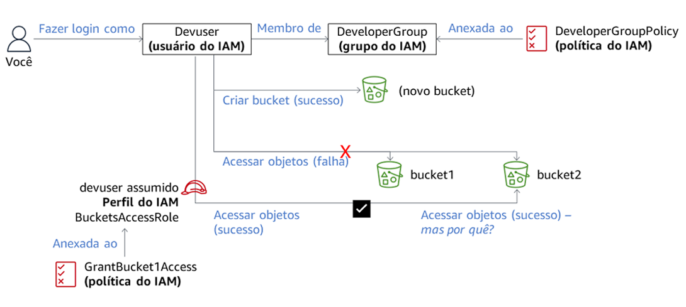
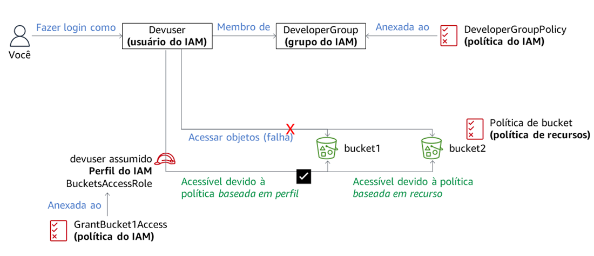
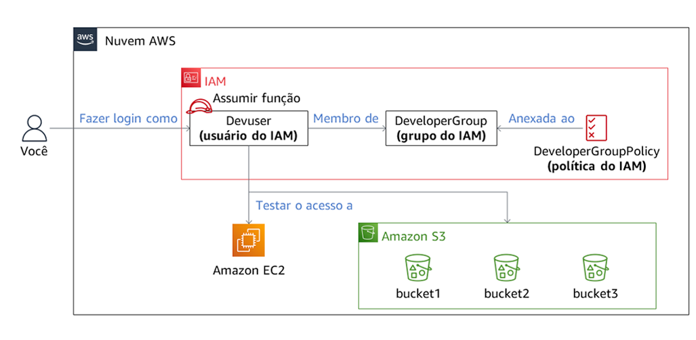

## AWS S3 Access Control & IAM Policy Lab

Este projeto demonstra como controlar acesso a dados no Amazon S3 utilizando políticas IAM e políticas baseadas em recurso.

## Objetivo

Entender como permissões são avaliadas na AWS usando:

- IAM policies (identity-based)
- Bucket policies (resource-based)
- Assume Role (STS)
- princípio do menor privilégio

## Ambiente

O laboratório continha:

- 3 buckets S3
- usuário IAM (devuser)
- grupo DeveloperGroup
- roles de acesso específicas
- políticas de controle de acesso

## Arquitetura e fluxo de permissões

### Arquitetura inicial do ambiente

### Restrições de acesso com usuário IAM

### Acesso após assumir role

### Interação entre policies baseadas em identidade e recurso

### Arquitetura final e fluxo completo de permissões

## Testes realizados

### Acesso EC2
Não autorizado.

### Acesso S3 como devuser
Download negado.  
Upload negado.

### Após assumir BucketsAccessRole
Download permitido no bucket1.  
Upload negado no bucket3.

### Após assumir OtherBucketAccessRole
Upload permitido no bucket3.

## Principais aprendizados

- políticas IAM definem permissões da identidade
- bucket policies concedem acesso direto ao recurso
- permissões são cumulativas
- deny explícito sempre prevalece
- assume role fornece permissões temporárias
- segurança AWS segue o princípio do menor privilégio

## Tecnologias utilizadas

- AWS IAM
- Amazon S3
- AWS STS
